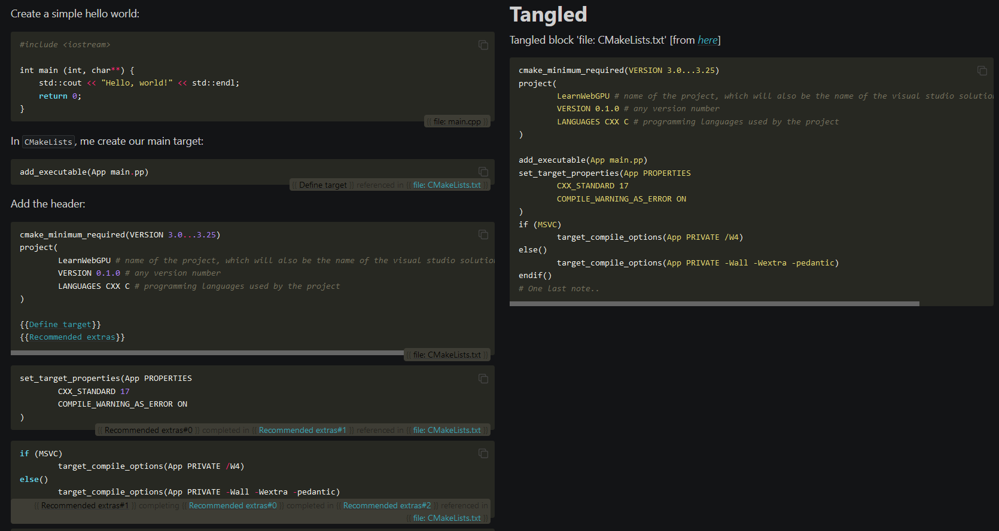

Sphinx Literate
===============

This is a sphinx extension inspired by *literate programming* that I develop for the redaction of the [LearnWebGPU C++ guide](https://eliemichel.github.io/LearnWebGPU).

Basically, the idea of *literate programming* is that instead of first writing a code with docstring comments and then extract a documentation out of it, we first write the documentation and specify how to connect the different code snippets together so that we can extract the source tree from the documentation (what is called "tangling").

**Important:** At this early stage, the project focuses on providing what I need for myself rather than properly documenting, because I focus on the redaction of the WebGPU guide, but feel free to reach out to get more info about the undocumented bits.

Building
--------

Building the website requires Python.

1. It is recommended, but not mandatory, to set up a virtual Python environment:

```
$ virtualenv venv
$ venv/Scripts/activate
```

2. Then install Python packages

```
pip install -r requirements.txt
```

3. Build the html documentation by running:

```
make html
```

4. And extract the source code from doc (what is call "tangling") by running:

```
make tangle
```

Basic usage
-----------

As I was saying, no time to fully document now, but you can still check out [`doc/introduction.md`](doc/introduction.md) for some details.


